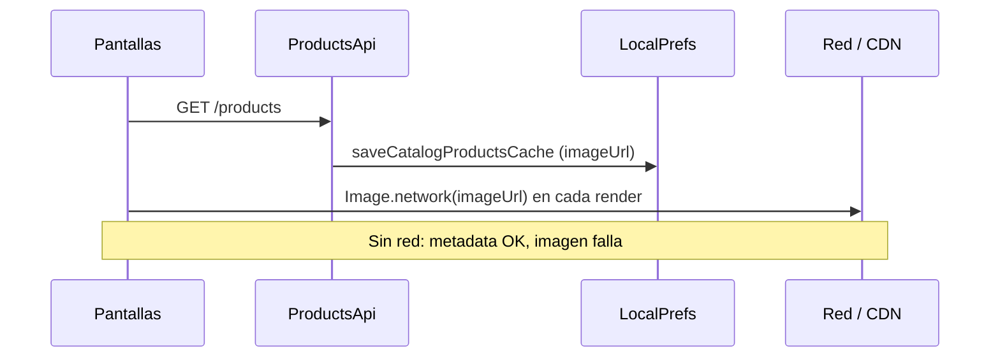
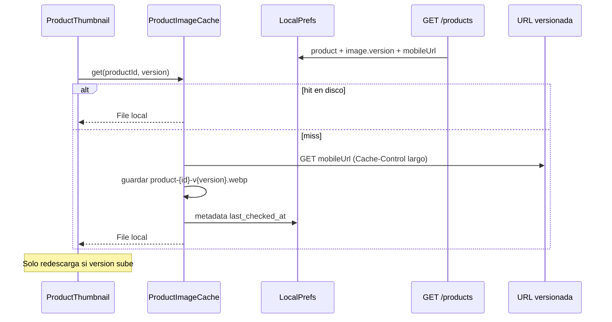

# Caché de imágenes de producto — Análisis e implementación

Documento de trabajo para la estrategia **URLs versionadas + caché local en disco**.  
El frontend no debe “pensar” en S3; solo consume metadata y URLs del backend y reutiliza bytes en disco mientras la versión no cambie.

**Estado:** plan frontend listo · **contrato backend pendiente de confirmación**

---

## 1. Resumen ejecutivo

| Capa | Responsabilidad |
|------|-----------------|
| **Backend** | Dueño del archivo, metadata, versión, URLs (`mobile` / `main`), `Cache-Control` largo en S3 |
| **Frontend (esta app)** | Dueño del caché local: descargar una vez, guardar en disco, reusar mientras `productId + version` coincidan |

**Decisión alineada con el repo:** no agregar SQLite para imágenes. El catálogo ya vive en `SharedPreferences` (`catalog_products_cache_v1`); los bytes de imagen van en **disco** (`path_provider`) con metadata ligera en prefs, igual que el resto de caches offline.

**Beneficio inmediato:** thumbnails visibles offline en Catálogo, POS y detalle de producto — hoy el metadata sobrevive offline pero `Image.network` falla sin red.

---

## 2. Estado actual en quick_pos

### 2.1 Lo que ya existe (reutilizable)

| Pieza | Ubicación | Rol |
|-------|-----------|-----|
| Modelo producto | `lib/core/models/catalog_product.dart` | Campo `imageUrl` (string opcional) |
| Resolución de URL | `lib/core/network/product_image_url.dart` | Convierte URL relativa / `localhost` → URL usable en emulador y LAN |
| API productos | `lib/core/api/products_api.dart` | `GET /products`, `PATCH /products/:id/image`, `DELETE /products/:id/image` |
| API uploads | `lib/core/api/uploads_api.dart` | `POST /uploads/products-image` → `{ fileId, url, mimeType, bytes }` |
| Caché catálogo | `lib/core/storage/local_prefs.dart` | JSON con `imageUrl` por producto |
| Invalidación catálogo | `lib/core/catalog/catalog_invalidation_bus.dart` | Señal tras pull / mutación local |
| Cola fotos offline | `lib/core/photos/product_photo_upload_sync.dart` | Sube foto local cuando hay red |
| Auto-sync | `lib/features/shell/main_shell.dart` | Cada 90s + reconexión; flush de fotos pendientes |
| UI con imágenes | `product_catalog_tab.dart`, `pos_sale_widgets.dart`, `inventory_product_detail_screen.dart` | `Image.network` + fallback de inicial |

### 2.2 Brechas vs estrategia objetivo

| Capacidad esperada | Estado actual |
|--------------------|---------------|
| Campo `image.version` en API | **No existe** — solo `imageUrl` opaco |
| URLs separadas `mobile` / `main` | **No existe** — una sola URL |
| Caché de bytes en disco | **No existe** |
| Clave `productId + version` | **No existe** |
| Thumbnails offline | **Roto** — metadata sí, imagen no |
| Widget unificado de thumbnail | **No existe** — lógica duplicada en 3+ archivos |
| Evicción al cambiar versión | **No existe** |
| Preview local desde cola de upload en POS/catálogo | **Parcial** — solo en formulario de producto |

### 2.3 Flujo actual (simplificado)



### 2.4 Flujo objetivo



---

## 3. Contrato backend — PENDIENTE DE CONFIRMACIÓN

> Marcar cada ítem cuando backend confirme forma final, nombres de campos y endpoints.

### 3.1 Respuesta de producto (propuesta)

Opción A — objeto anidado (preferida para claridad):

```json
{
  "id": "45",
  "name": "Arroz 1kg",
  "image": {
    "version": 2,
    "mobileUrl": "/files/products/45/v2/mobile.webp",
    "mainUrl": "/files/products/45/v2/main.webp"
  }
}
```

Opción B — campos planos (menor cambio en Nest si ya serializan plano):

```json
{
  "id": "45",
  "imageVersion": 2,
  "imageMobileUrl": "/files/products/45/v2/mobile.webp",
  "imageMainUrl": "/files/products/45/v2/main.webp"
}
```

**Compatibilidad transitoria:** mientras no exista `version`, el cliente puede tratar `imageUrl` legacy como `version = 1` y usar esa URL como `mobileUrl`.

### 3.2 Reglas que el backend debe garantizar

- [ ] **PENDIENTE:** Al subir o reemplazar imagen, incrementar `version` y publicar URLs nuevas (ej. `.../v3/mobile.webp`).
- [ ] **PENDIENTE:** URLs versionadas con `Cache-Control: max-age=31536000` en S3/CDN.
- [ ] **PENDIENTE:** `GET /products` y `GET /products/:id` incluyen metadata de imagen completa.
- [ ] **PENDIENTE:** `PATCH /products/:id/image` devuelve producto con nueva `version` + URLs (no solo `imageUrl` string).
- [ ] **PENDIENTE:** `POST /uploads/products-image` devuelve `{ version, mobileUrl, mainUrl }` además de o en lugar de `url` genérico.
- [ ] **PENDIENTE:** `DELETE /products/:id/image` pone `version = 0` o elimina objeto `image`; cliente debe borrar caché local.
- [ ] **PENDIENTE:** Confirmar si URLs son absolutas (CDN) o relativas al API (hoy el front ya soporta ambas vía `resolveProductImageUrl`).

### 3.3 Preguntas abiertas para backend

| # | Pregunta | Respuesta |
|---|----------|-----------|
| 1 | ¿Objeto `image` anidado o campos planos? | _pendiente_ |
| 2 | ¿Nombre exacto: `mobileUrl` vs `thumbnailUrl`? | _pendiente_ |
| 3 | ¿Upload sigue siendo `POST /uploads/products-image` o pasa a otro flujo? | _pendiente_ |
| 4 | ¿El pull (`sync/pull`) notifica cambio de imagen vía `PRODUCT_UPDATED` con campos nuevos? | _pendiente_ |
| 5 | ¿Hay límite de tamaño / formato aceptado en upload (WebP-only en servidor)? | _pendiente_ |

---

## 4. Diseño frontend (alineado a la infraestructura del repo)

### 4.1 Principios (no negociables)

1. **No** pedir la imagen en cada render — el widget consulta caché local primero.
2. **No** depender de limpiar caché manual del usuario.
3. **No** agregar SQLite/Room — bytes en disco, metadata en `LocalPrefs`.
4. **Sí** reutilizar `resolveProductImageUrl`, `CatalogInvalidationBus`, cola de fotos y patrón JSON-en-prefs.
5. **Sí** un solo widget `ProductThumbnail` para Catálogo, POS y detalle.

### 4.2 Nuevos archivos propuestos

| Archivo | Responsabilidad |
|---------|-----------------|
| `lib/core/models/product_image.dart` | DTO: `version`, `mobileUrl`, `mainUrl`; parse desde JSON anidado o plano + fallback legacy |
| `lib/core/photos/product_image_cache.dart` | Descarga, guarda, lee, evicta por `productId + version` |
| `lib/core/photos/product_image_cache_entry.dart` | `productId`, `imageVersion`, `cachedFilePath`, `lastCheckedAt` |
| `lib/core/widgets/product_thumbnail.dart` | UI: caché → red → fallback inicial / archivo local pendiente |

### 4.3 Archivos a modificar

| Archivo | Cambio |
|---------|--------|
| `lib/core/models/catalog_product.dart` | Agregar `ProductImage? image` (mantener `imageUrl` deprecated/compat) |
| `lib/core/storage/local_prefs.dart` | Serializar `image` en catálogo; clave `product_image_cache_meta_v1` |
| `lib/core/network/product_image_url.dart` | Helper `productImageCacheKey(productId, version)` |
| `lib/app.dart` | Instanciar `ProductImageCache` e inyectar donde corresponda |
| `lib/features/inventory/product_catalog_tab.dart` | Reemplazar `Image.network` → `ProductThumbnail` |
| `lib/features/sale/pos_sale_widgets.dart` | Idem |
| `lib/features/inventory/inventory_product_detail_screen.dart` | Idem (usar `mainUrl` si existe, si no `mobileUrl`) |
| `lib/features/shell/main_shell.dart` | Tras upload exitoso: evict versión anterior + precache nueva |
| `pubspec.yaml` | Agregar `path_provider` (disco); evaluar si hace falta `http` directo para download (ya está) |

### 4.4 Qué guarda la app localmente

**En disco** (`getApplicationDocumentsDirectory()/product_images/`):

```
product-{productId}-v{version}.webp
```

**En SharedPreferences** (`product_image_cache_meta_v1`):

```json
[
  {
    "productId": "45",
    "imageVersion": 2,
    "cachedFilePath": "/data/.../product-45-v2.webp",
    "lastCheckedAt": "2026-06-09T12:00:00.000Z"
  }
]
```

**En catálogo existente** (`catalog_products_cache_v1`): incluir objeto `image` completo además de compat `imageUrl`.

### 4.5 Lógica del cliente (pseudocódigo)

```
resolvedMobile = resolveProductImageUrl(product.image?.mobileUrl ?? product.imageUrl)
version = product.image?.version ?? legacyHashOrDefault(imageUrl)

if cache.has(productId, version):
  return Image.file(cache.path)

if pendingPhotoQueue.hasLocalFile(productId):
  return Image.file(localPending)   // offline preview

bytes = await http.get(resolvedMobile)
cache.save(productId, version, bytes)
return Image.file(cache.path)
```

### 4.6 Invalidación y limpieza

| Evento | Acción |
|--------|--------|
| Catálogo refrescado y `version` subió | Evict archivo `v{old}`; descargar `v{new}` en background |
| `image` eliminado (`version = 0`) | Evict todas las versiones de ese `productId` |
| Upload local exitoso | Evict anterior; guardar nueva versión del servidor |
| Archivo en disco borrado manualmente | Metadata se corrige en próximo miss (re-descarga) |
| Limpieza opcional (fase 2) | Borrar entradas cuyo `productId` ya no está en catálogo |

### 4.7 Dependencia de paquetes

**Recomendado (mínimo):**

- `path_provider` — rutas de documents dir (estándar Flutter, sin magia).

**No recomendado por ahora:**

- `cached_network_image` / `flutter_cache_manager` — añaden capa genérica keyed por URL; nuestra clave es `productId + version`, más explícita y controlable con poco código propio en `lib/core/photos/`.

---

## 5. Plan de implementación por fases

Completar checkboxes conforme se avance. Cada fase puede ser un PR pequeño.

---

### Fase 0 — Alineación con backend

- [ ] **0.1** Enviar sección 3 de este doc al equipo backend.
- [ ] **0.2** Confirmar forma JSON final (`image` anidado vs plano).
- [ ] **0.3** Confirmar endpoints de upload / associate / delete y respuestas nuevas.
- [ ] **0.4** Confirmar que URLs versionadas tendrán `Cache-Control` largo en CDN.
- [ ] **0.5** Actualizar tabla 3.3 con respuestas concretas.
- [ ] **0.6** Acordar periodo de compatibilidad con `imageUrl` legacy.

---

### Fase 1 — Modelo y contrato en código (sin UI)

- [ ] **1.1** Crear `lib/core/models/product_image.dart` con `fromJson` tolerante (anidado, plano, legacy).
- [ ] **1.2** Extender `CatalogProduct` con `ProductImage? image`.
- [ ] **1.3** Mantener getter `imageUrl` como alias de `image?.mobileUrl ?? _legacyImageUrl` para no romper call sites de golpe.
- [ ] **1.4** Actualizar `LocalPrefs.saveCatalogProductsCache` / `loadCatalogProductsCache` para serializar `image`.
- [ ] **1.5** Agregar tests unitarios de parseo JSON (legacy, nuevo, sin imagen).

---

### Fase 2 — Caché en disco

- [ ] **2.1** Agregar `path_provider` en `pubspec.yaml`.
- [ ] **2.2** Crear `ProductImageCacheEntry` y persistencia en `product_image_cache_meta_v1`.
- [ ] **2.3** Implementar `ProductImageCache`:
  - [ ] `Future<File?> getFile(String productId, int version)`
  - [ ] `Future<File> put(String productId, int version, List<int> bytes)`
  - [ ] `Future<void> evict(String productId, {int? version})`
  - [ ] `Future<void> evictAllExcept(Set<String> activeProductIds)` _(opcional fase 2b)_
- [ ] **2.4** Implementar descarga HTTP con timeout alineado a `ApiClient` (12s).
- [ ] **2.5** Agregar `productImageCacheKey` en `product_image_url.dart`.
- [ ] **2.6** Test manual: guardar/leer/evict en emulador.

---

### Fase 3 — Widget unificado

- [ ] **3.1** Crear `ProductThumbnail` en `lib/core/widgets/product_thumbnail.dart`.
- [ ] **3.2** Props: `productId`, `ProductImage? image`, `String? legacyImageUrl`, `double size`, `BoxFit fit`.
- [ ] **3.3** Estados: loading shimmer o placeholder, error → inicial del nombre, éxito → `Image.file`.
- [ ] **3.4** Fallback a archivo local de `pending_product_photo_uploads_v1` si offline y hay cola.
- [ ] **3.5** Inyectar `ProductImageCache` (constructor desde pantallas o vía `app.dart`).

---

### Fase 4 — Integración en pantallas

- [ ] **4.1** `product_catalog_tab.dart` — reemplazar `Image.network`.
- [ ] **4.2** `pos_sale_widgets.dart` — tiles de búsqueda y carrito.
- [ ] **4.3** `inventory_product_detail_screen.dart` — foto grande (`mainUrl` preferido).
- [ ] **4.4** Verificar que `product_form_screen.dart` sigue mostrando preview local antes de upload.
- [ ] **4.5** Eliminar helpers duplicados `_resolvedImageUrl` donde el widget centralice la lógica.

---

### Fase 5 — Invalidación y sync

- [ ] **5.1** Al `saveCatalogProductsCache`: comparar versiones anteriores vs nuevas; evict cambios.
- [ ] **5.2** Escuchar `CatalogInvalidationBus` para precache en background de productos tocados.
- [ ] **5.3** En `main_shell.dart` tras flush de foto: evict + precache con respuesta del servidor.
- [ ] **5.4** Tras `DELETE /products/:id/image`: evict caché de ese producto.
- [ ] **5.5** Precache opcional: al cargar catálogo, descargar thumbnails de productos visibles en background (limitar concurrencia, ej. 3).

---

### Fase 6 — QA y documentación

- [ ] **6.1** Escenario online: primera carga descarga; segunda carga usa disco (sin request redundante).
- [ ] **6.2** Escenario offline: catálogo cacheado muestra thumbnails ya descargados.
- [ ] **6.3** Escenario cambio de versión: backend responde `version = 3` → nueva descarga, archivo `v2` evictado.
- [ ] **6.4** Escenario upload offline → online: foto local visible hasta sync; luego URL versionada del servidor.
- [ ] **6.5** Escenario sin imagen: placeholder de inicial (comportamiento POS actual).
- [ ] **6.6** Emulador (`10.0.2.2`) y dispositivo LAN: URLs resueltas correctamente.
- [ ] **6.7** Actualizar `docs/FRONTEND_INTEGRATION_CONTEXT.md` sección fotos cuando backend confirme.
- [ ] **6.8** Agregar casos a `docs/MANUAL_TESTS.md`.

---

## 6. Qué NO debe hacer el frontend

| Prohibido | Motivo |
|-----------|--------|
| Referenciar S3, buckets o keys en UI/código de dominio | El cliente solo ve URLs HTTP |
| `Image.network` directo en listas de producto | Re-descarga implícita; no funciona offline |
| Caché keyed solo por URL sin versión | Si la URL no cambia al actualizar contenido, imagen stale |
| SQLite para bytes de imagen | Fuera del patrón del repo; catálogo ya es prefs + REST |
| Limpiar caché manual como requisito del usuario | La versión es la fuente de verdad de invalidación |
| Bloquear navegación esperando descarga masiva | Precache en background; UI muestra placeholder |

---

## 7. Criterios de aceptación

1. Con catálogo cacheado y sin red, los productos con imagen previamente descargada muestran thumbnail correcto.
2. Si `image.version` no cambia entre refrescos, no hay descarga HTTP adicional del mismo producto.
3. Si `image.version` incrementa, la UI muestra la nueva imagen tras una sola descarga.
4. Upload / delete de foto actualiza caché local coherentemente con el servidor.
5. Un solo componente (`ProductThumbnail`) usado en Catálogo, POS y detalle.
6. Compatibilidad con respuestas que aún solo traen `imageUrl` (modo legacy) hasta que backend despliegue campos nuevos.

---

## 8. Bitácora de progreso

| Fecha | Tarea | Notas |
|-------|-------|-------|
| 2026-06-09 | Documento creado | Análisis inicial; backend pendiente |
| | | |
| | | |

---

## 9. Referencias internas

- Arquitectura general: `docs/FRONTEND_INTEGRATION_CONTEXT.md`
- Modelo actual: `lib/core/models/catalog_product.dart`
- URL helper: `lib/core/network/product_image_url.dart`
- Cola fotos: `lib/core/photos/product_photo_upload_sync.dart`
- Invalidación catálogo: `lib/core/catalog/catalog_invalidation_bus.dart`
